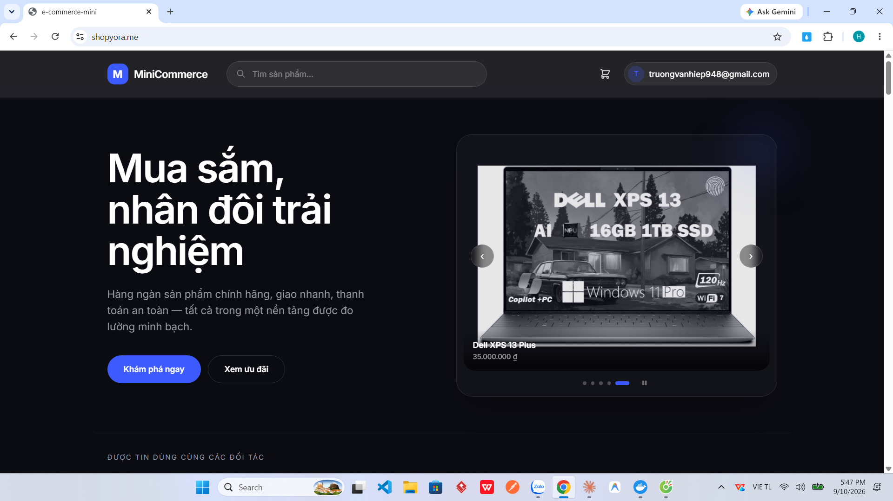
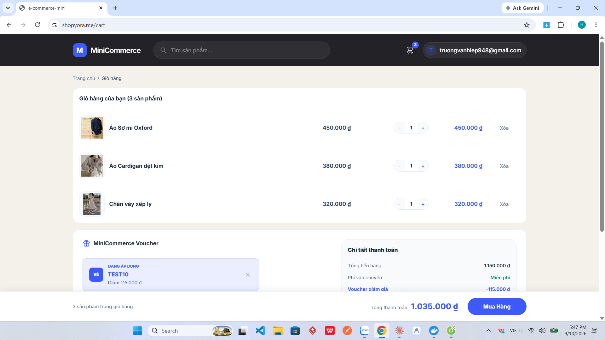
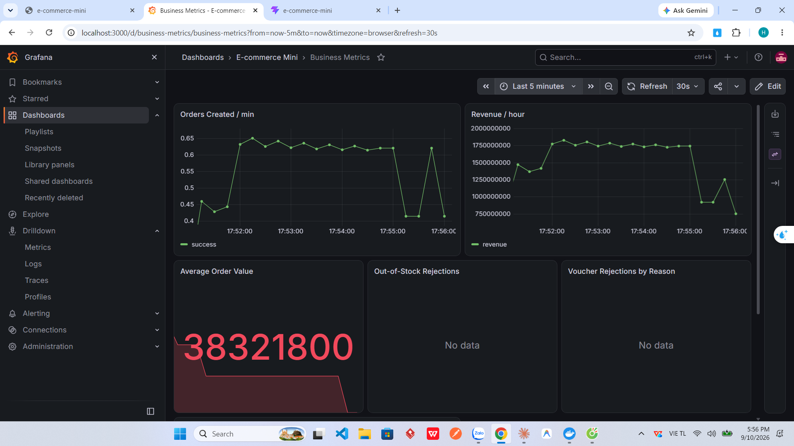
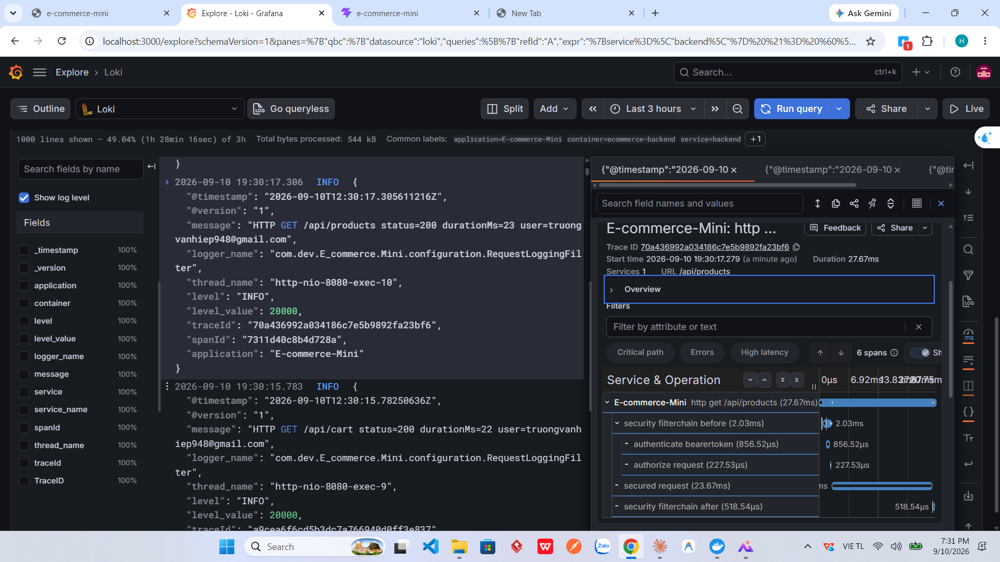

# E-commerce Mini

**Demo: [shopyora.me](https://shopyora.me)**

Nền tảng thương mại điện tử full-stack: Spring Boot + React, kèm bộ observability
ba trụ cột (metrics / logs / traces) và các lớp bảo mật thường thấy ở hệ thống
chạy thật — refresh token xoay vòng, rate limiting nhiều tầng, validate đầu vào.

Bản demo chạy trên Northflank với domain riêng, HTTPS, và tự động deploy mỗi khi
có commit mới vào `main`.

## Chạy tại máy

Toàn bộ hệ thống — 8 container — khởi động bằng **một lệnh**.

```bash
cp .env.example .env    # điền secret
docker compose up -d --build
```

| | |
|---|---|
| Giao diện | http://localhost:5173 |
| API | http://localhost:8080 |
| Grafana | http://localhost:3000 |

Lần đầu chạy còn hai bước nữa:

1. **Nạp dữ liệu mẫu** — `seed-full.sql` có sẵn 39 sản phẩm, 5 danh mục và các
   index tối ưu (kể cả FULLTEXT cho tìm kiếm):
   ```bash
   docker exec -i ecommerce-mysql sh -c 'mysql -uroot -p"$MYSQL_ROOT_PASSWORD" e_commerce_mini' < seed-full.sql
   ```
   Mật khẩu nằm trong dấu nháy đơn để shell **bên trong container** thay giá
   trị — biến đó không tồn tại trên máy bạn.
2. **Đăng nhập Google** cần thêm redirect URI vào Google Cloud Console →
   Credentials → OAuth client:
   ```
   http://localhost:5173/login/oauth2/code/google
   ```
   Thiếu bước này thì Google báo `redirect_uri_mismatch`. Đăng nhập bằng tài
   khoản/mật khẩu vẫn hoạt động bình thường.

---

## Ảnh chụp màn hình

**Trang chủ** — carousel lấy ảnh trực tiếp từ danh sách sản phẩm trong database,
tự chuyển 5 giây một lần, có nút tạm dừng.



**Giỏ hàng** — voucher hiện sẵn để bấm chọn kèm số tiền được giảm tính theo giá
trị giỏ hàng, thay vì bắt người dùng tự biết mã rồi gõ tay.



**Business metrics** — đơn hàng/phút, doanh thu/giờ, giá trị đơn trung bình,
voucher bị từ chối theo lý do. Đây là metric nghiệp vụ do ứng dụng tự phát ra
qua Micrometer, không phải chỉ số hạ tầng có sẵn.



**Tương quan log ↔ trace** — từ một dòng log bấm thẳng sang trace tương ứng
trong Tempo. Trace tách được từng chặng: xác thực token 856µs, kiểm tra quyền
227µs, xử lý nghiệp vụ 23.67ms trong tổng 27.67ms.



## Tính năng

**Người mua** — duyệt sản phẩm theo danh mục, tìm kiếm full-text, xem chi tiết,
giỏ hàng, sổ địa chỉ, đặt hàng, xem lịch sử đơn, viết đánh giá (chỉ cho sản
phẩm đã thực sự mua). Nhận email xác nhận đơn hàng.

**Voucher** — danh sách ưu đãi hiện sẵn trong giỏ hàng để bấm chọn, kèm số tiền
được giảm tính theo giá trị giỏ hàng hiện tại. Mã chưa đủ điều kiện vẫn hiện,
kèm gợi ý cần mua thêm bao nhiêu.

**Quản trị** — quản lý sản phẩm, đơn hàng, voucher; phân quyền theo role và
permission ở tầng method (`@PreAuthorize`).

**Tài khoản** — đăng ký, đăng nhập, đăng nhập Google (OAuth2), access token
ngắn hạn kèm refresh token xoay vòng.

Quy mô: 14 controller, 18 service, 15 entity.

## Kiến trúc

```
Browser → frontend (nginx :5173) ──/api──► backend (Spring Boot :8080) → MySQL
                                              │
              ┌───────────────────────────────┼──────────────────────────┐
              │                               │                          │
     /actuator/prometheus              OTLP traces              JSON logs (stdout)
              │                               │                          │
        Prometheus :9090                Tempo :3200          Promtail → Loki
              │                               │                          │
              └───────────────┬───────────────┴──────────────────────────┘
                              │
                        Grafana :3000
              dashboards • alert rules • tương quan trace ↔ log
```

## Công nghệ

| Lớp | Thành phần |
|---|---|
| Backend | Java 17, Spring Boot 3.5.16, Spring Security 6, Spring Data JPA, MapStruct, Lombok |
| Xác thực | JWT (Nimbus HS512), OAuth2 Resource Server + Google OAuth2 Login |
| Database | MySQL 8.4 |
| Frontend | React 19, Vite 8, Tailwind CSS 4, React Router 7, Axios |
| Observability | Micrometer, Prometheus, Loki + Promtail, Tempo (OpenTelemetry OTLP), Grafana |
| Rate limiting | Bucket4j + Caffeine |
| Email | Resend (production) / SMTP (dev) |
| Kiểm thử | JUnit 5, Mockito, Testcontainers |
| Hạ tầng | Docker Compose, Caddy (VPS) hoặc Northflank (PaaS) |

## Điểm kỹ thuật đáng chú ý

### Refresh token xoay vòng, có phát hiện tái sử dụng

Access token hết hạn sau 15 phút; client tự gia hạn bằng refresh token (7 ngày).
Mỗi lần gia hạn, token cũ bị thu hồi và cấp token mới. Nếu một token **đã dùng
rồi** xuất hiện lần nữa — dấu hiệu bị đánh cắp — toàn bộ phiên đăng nhập của
tài khoản đó bị thu hồi.

Phần thu hồi chạy trong transaction riêng (`Propagation.REQUIRES_NEW`). Đây là
một bug thật: ban đầu việc thu hồi nằm chung transaction với lệnh `throw` báo
lỗi, nên exception cuốn luôn cả lệnh thu hồi vào rollback — token bị đánh cắp
vẫn dùng được. Test dùng mock vẫn pass; chỉ chạy thật với database mới lộ ra.

Phía client, `axiosClient` tự gọi gia hạn khi gặp 401 và xếp hàng các request
đang chờ, tránh nhiều request cùng lúc kích hoạt nhiều lần gia hạn song song.

### Rate limiting bốn tầng

| Tầng | Phạm vi | Giới hạn |
|---|---|---|
| STRICT | đăng nhập, áp voucher | 5 lần / 15 phút |
| REGISTER | đăng ký tài khoản | 20 lần / 15 phút |
| WRITE | mọi POST/PUT/DELETE khác | 60 / phút |
| GLOBAL | phần còn lại | 200 / phút |

Đăng ký tách riêng khỏi STRICT vì bản chất khác hẳn: đăng ký hỏng không tiết lộ
gì cho kẻ tấn công, trong khi người dùng thật hay phải thử lại vài lần. Gộp
chung khiến gõ sai mật khẩu 5 lần là nghẽn luôn cả chức năng đăng ký.

Trả về `429` kèm header `Retry-After` và `X-RateLimit-Remaining` (đã khai báo
trong `exposedHeaders` của CORS, nếu không trình duyệt không đọc được).

Bucket khoá theo `getRemoteAddr()`, **không** tự đọc `X-Forwarded-For` — chạy
local không có proxy tin cậy nào phía trước thì kẻ tấn công chỉ cần đổi header
là thoát giới hạn. Khi deploy sau reverse proxy mới bật
`SERVER_FORWARD_HEADERS_STRATEGY=framework`, lúc đó backend không mở port ra
ngoài nên header không giả mạo được.

### Tương quan trace ↔ log

Micrometer Tracing sinh `traceId`/`spanId` cho mỗi request và đưa vào MDC. Log
JSON và span gửi sang Tempo mang cùng `traceId`, nên trong Grafana có thể bấm
từ một dòng log sang đúng trace của nó và ngược lại.

Ngoài metric hạ tầng còn có metric nghiệp vụ: đơn hàng theo trạng thái, doanh
thu, số lần hết hàng, voucher bị từ chối theo lý do, thanh toán theo phương thức.

Có sẵn 2 dashboard và 3 alert rule (tỉ lệ 5xx, p95 latency, backend down), tất
cả được provision tự động khi Grafana khởi động.

### Email xác nhận đơn hàng vào được hộp thư đến

Ban đầu gửi qua SMTP của Gmail bằng app password. Thư gửi thành công, log không
có lỗi — nhưng **luôn rơi vào thư rác**. Nguyên nhân: địa chỉ `@gmail.com` không
có SPF/DKIM chứng minh quyền gửi thay cho một tên miền nào, nên thư giao dịch từ
nguồn này bị bộ lọc nghi ngờ. Sửa nội dung thư chỉ giảm bớt chứ không giải quyết
được gốc.

Cách xử lý: tách việc gửi thư ra sau interface `EmailSender`, hai cài đặt chọn
bằng cấu hình — SMTP cho môi trường phát triển, Resend cho production với tên
miền riêng đã cấu hình SPF/DKIM/DMARC.

Resend còn tránh được một rủi ro khác: nó đi qua cổng 443 thay vì cổng SMTP
(25/465/587). Nhiều nền tảng hosting chặn các cổng đó để chống spam, khi ấy gửi
qua SMTP sẽ treo tới lúc timeout mà không có thông báo rõ ràng.

Thư gửi kèm cả bản HTML lẫn bản chữ thuần — thư chỉ có HTML bị bộ lọc spam cộng
điểm. HTML dùng CSS nội tuyến và bảng để dàn trang vì Outlook và Gmail bản web
cắt bỏ thẻ `<style>` và không hỗ trợ flexbox/grid.

### Deploy được ở hai kiểu hạ tầng

- **VPS tự quản** — `docker-compose.prod.yml` + Caddy, HTTPS tự động, đóng toàn
  bộ port nội bộ, chỉ mở 80/443. Xem [DEPLOYMENT.md](DEPLOYMENT.md).
- **PaaS** (Northflank, Railway...) — 3 service, dùng database quản lý sẵn, địa
  chỉ backend và endpoint tracing cấu hình qua biến môi trường. Xem
  [DEPLOY_NORTHFLANK.md](DEPLOY_NORTHFLANK.md).

## Kiểm thử

```bash
cd backend/E-commerce-Mini && ./mvnw test
```

13 test, chạy được ở mọi máy có Docker:

- **12 unit test** (JUnit 5 + Mockito) — rate limiting (4) và vòng đời refresh
  token (8): xoay vòng, phát hiện tái sử dụng, thu hồi toàn bộ phiên.
- **1 integration test** — nạp toàn bộ Spring context trên một MySQL thật do
  **Testcontainers** dựng trong Docker, chạy xong tự xoá. Nó bắt được lớp lỗi
  mà mock không thấy: bean cấu hình sai, schema Hibernate không dựng được,
  placeholder thiếu giá trị.

Trước đây test integration này kết nối thẳng `localhost:3306` nên kết quả phụ
thuộc máy chạy — máy không có MySQL thì "connection refused", máy có MariaDB ở
cổng đó thì lỗi plugin xác thực. Testcontainers loại bỏ hẳn sự phụ thuộc đó.

## Cấu trúc thư mục

```
backend/E-commerce-Mini/     Spring Boot API
frontend/E-commerce-mini/    React SPA (nginx phục vụ bản build)
observability/               config Prometheus, Loki, Promtail, Tempo, Grafana
deploy/                      Caddyfile cho production
docker-compose.yml           stack đầy đủ cho phát triển
docker-compose.prod.yml      lớp ghi đè cho production trên VPS
```

## Tài liệu

| File | Nội dung |
|---|---|
| [OBSERVABILITY.md](OBSERVABILITY.md) | Kiến trúc logging/monitoring, dashboard, alert, metric nghiệp vụ |
| [SECURITY.md](SECURITY.md) | Kết quả audit bảo mật, các lỗ hổng đã vá và còn tồn tại |
| [DEPLOYMENT.md](DEPLOYMENT.md) | Deploy lên VPS với Caddy + HTTPS |
| [DEPLOY_NORTHFLANK.md](DEPLOY_NORTHFLANK.md) | Deploy lên nền tảng quản lý sẵn |

## Hạn chế đã biết

Ghi ra đây để minh bạch, không phải để bỏ qua:

- `spring.jpa.hibernate.ddl-auto: update` — Hibernate tự sửa schema, chưa dùng
  công cụ migration (Flyway/Liquibase). Đủ cho demo, rủi ro với dữ liệu thật.
- Dữ liệu mẫu và index tối ưu nằm ở `seed-full.sql`, phải nạp tay sau lần khởi
  động đầu — chưa tự động hoá.
- Rate limit lưu trong bộ nhớ tiến trình. Chạy nhiều instance backend thì mỗi
  instance đếm riêng, phải chuyển sang store dùng chung (Redis).
- Đăng nhập thành công cũng tiêu một lượt trong hạn mức 5 lần/15 phút. Đúng hơn
  là chỉ nên đếm lần **thất bại**.
- Rate limit khoá theo IP, nên nhiều người dùng chung một NAT sẽ chia nhau hạn
  mức. Muốn chính xác hơn phải khoá theo tài khoản.
- Promtail cần quyền đọc Docker socket nên không chạy được trên PaaS; ở đó
  observability dùng công cụ sẵn có của nền tảng.
- `/actuator` đang để public cho Prometheus scrape và Docker healthcheck.
- Độ phủ test còn mỏng: mới tập trung vào xác thực và rate limiting, chưa có
  test cho luồng đặt hàng, giỏ hàng và voucher.
